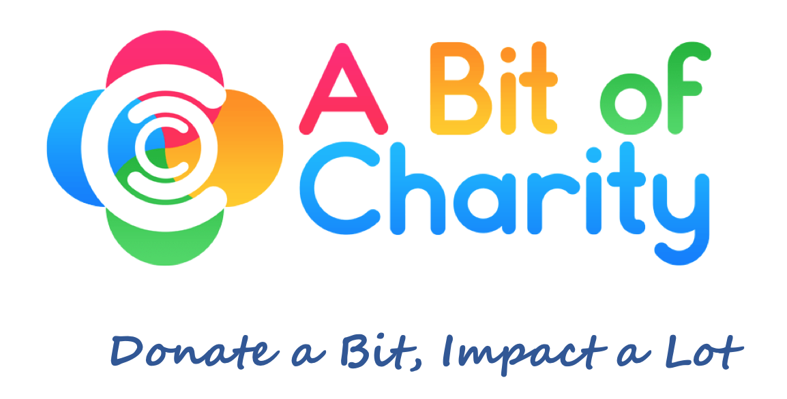

# ABitOfCharity

A Bit Of Charity attempts to simplify and incentivize the processes of donating crypto currency to charitable organizations by serving as an intermediary. We integrate these transactions into an open smart contract on the Ethereum blockchain, so  that the donor isn't required to put his trust in our ogranization alone. As A Bit Of Charity is also designed to be an NGO, we aim to simplify the process of getting tax deduction for donations made with crypto currency by issueing our own donation certificate (for tax purposes) and serve as an intermediary in this area as well.

The simplify the process of donating crypto currency we, setup a small webapp which allows the donor to distribute his Ether between multiple charitable organizations in the same transaction.

The incentivization of the donor is to be done via a special ChariBit Token, which he or she gets in return for its donation. These tokens can be used to get access to or price reduction for on special environmental events or sustainable trips provided by our partner organizations.

## Origins

A Bit Of Charity is a blockchain project which was created in February 2019 during the [BETH Hackathon](http://www.coss.ethz.ch/education/BETH.html) at ETH Zurich. 

It consists of a smart contract written in Solidity and a small (mostly) static webapp to showcase some of its functionality.

## Requirements

This following things are required to run this project:

* [Metamask Extension](https://metamask.io/) for your browser
* [Ganache](https://truffleframework.com/ganache) to run a local blockchain
* [Python](https://www.python.org/) to serve as a simple backend for the webapp

## Setup

To setup the webapp:

1. Start a terminal, navigate to `webapp/` and start a python webserver with `python -m SimpleHTTPServer 8000`.
2. Open [localhost:8000](http://localhost:8000).

To setup the blockchain:

1. Start Ganache. You might want to increase the gas limit.
2. Change the network of metamask to your local one (Ganache) and import one of the generated addresses from Ganache into Metamask.
3. Insert six addresses from Ganache into `charity_accounts` on the first line of `webapp/js/donations.js`.
4. Open the [Remix Online IDE](http://remix.ethereum.org) and import the contracts from `smart_contracts/contracts/`.
5. Select a suiting compiler (version 0.5.2) and compile the contracts.
6. Run the IDE with 'Injected Web3' and deploy the `ABitOfCharity` contract (you might have to increase the gas limit on Remix as well).
7. Copy the address of the contract and insert in line 24 of `webapp/js/donation.js`.
8. Add six organizations to the contract. You can either do this through Remix or by uncommenting lines 26 to 28 in `webapp/js/donations.js` and visiting [localhost:8000/donate](http://localhost:8000/donate) (after you have started the webserver)
